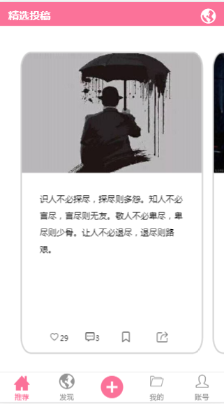
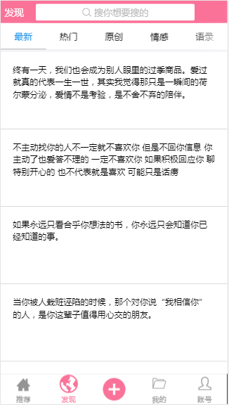
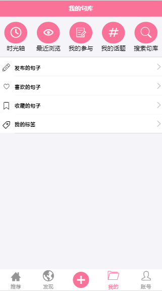
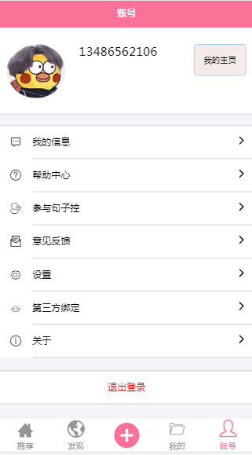
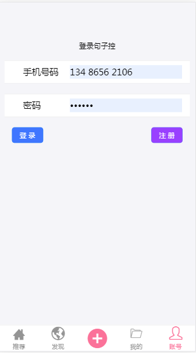

# 项目：句子控
## 团队介绍
### 团队成员与任务划分：
#### 组长：王琳沣
    主要工作： 
      1.登陆页面
      2.注册页面
      3.git的相关使用 
      4.数据获取
      5.编写mb文档
#### 成员：覃钧
    
     主要工作：
       1.编写app首页 
       2.编写后台接口 
       3.编写后台管理系统
       4.项目上线
#### 成员：区嘉俊
     主要工作：
       1.编写app首页 
       2.编写后台接口 
       3.编写后台管理系统
       4.项目上线
## 目录
* [背景介绍](#背景介绍)

* [项目介绍](#项目介绍)

* [使用说明](#使用说明)

  * [获取代码](#获取代码)

  * [开发框架与插件](#开发框架与插件)


* [项目图片](#项目图片)

  * [首页](#推荐)

  * [发现](#发现)

  * [我的](#我的)

  * [账号](#账号)

  * [登陆](#登陆) 

  * [注册](#注册)

* [项目目录](#项目目录)

  
<a name="背景介绍"></a>
## 背景介绍

* 你是否经常被一句唯美的句子打动，是否偶尔碰到一句犀利的言辞，有种醍醐灌顶的感觉。一句歌词，一段对白，一句摘抄，一句语录，触动人心的往往是一些短小精悍的经验总结。
* 生活中遇到精彩句子，我们通常会记录到纸质笔记本，手机备忘录，微信，云笔记等等。但是当自己想要找到某些句子时，又常常大费周章的去翻阅查询，甚至有些笔记已经遗失。

<a name="项目介绍"></a>
## 项目介绍

* 句子控 * 句子控是一个随身摘抄本,在这里您可以随时发布、收藏和找到您喜欢的句子,句子控汇集众多名人名言、经典名句、电影台词和歌词。 同时,你还可以在这里找到那些与你有着共同喜好的人
* 句子控致力于解决收集与分享的问题，帮您高效的整理句子，给您高效的推荐句子。句子控们可以在平台上一起沉淀智慧的精华。
<a name="使用说明"></a>
## 使用说明

<a name="获取代码"></a>
### 获取代码

* github项目主页: <https://github.com/gzh51910/mySentence.git>

* 仿照项目PC网址：<https://www.juzikong.com/>

* 网站上线网址：

* app测试账号：有默认账号
* 后台管理系统网址：
    * 测试账号：
    * 测试密码：

### 打开与配置项目
* Project setup
```
npm install
```

* Compiles and hot-reloads for development
```
npm run dev
```

* Compiles and minifies for production
```
npm run build
```
   
<a name="开发框架与插件"></a>
### 开发框架与插件

在*句子控*中，插件就像一块一块的积木，不但支撑着框架的功能，也是框架可扩展性的基石。

1.使用react<br>
2.使用webpack自己搭建脚手架<br>
3.使用react-router-dom<br>
4.使用react-redux<br>
5.使用移动端antd-mobiled ui框架<br>
6.使用node.js<br>
7.使用express插件<br>
8.使用axios<br>
9.使用数据库可视化工具<br>
10.使用Mongodb<br>
11.使用git合作开发
12.使用部分ES6语法(箭头函数)


<a name="项目图片"></a>
## 项目图片

<a name="首页"></a>
## 首页

```
    进入首页默认选中推荐且高亮，并显示推荐页的内容,中间的轮播图采用了antd-mobiled ui中的轮播图来实现
```

<a name="发现"></a>
## 发现

```
    顶部有一个搜索栏可以搜索你想搜的(然而并没有实现)，中间显示分类，默认显示5个 。
```

<a name="我的"></a>
## 我的

```
    显示我的关注，我发布的句子,收藏的句子,等。
```

<a name="账号"></a>
## 账号

```
   显示登陆状态以及软件设置和帮助中心等功能
```
<a name="登陆"></a>
## 登陆

```
    顾名思义登陆
```
<a name="注册"></a>
## 注册

```
    同上
```

<a name="项目目录"></a>
## 项目目录
```src
src:.
│  App.js
│  main.js
│
├─Api
│      index.js
│      my.js
│
├─Css
│      App.css
│      choiceness.css
│      find.css
│      goods.css
│      goods.min.css
│      goods.scss
│      home.css
│      Moren.css
│
├─iconfont
│      demo.css
│      demo_index.html
│      iconfont.css
│      iconfont.eot
│      iconfont.js
│      iconfont.json
│      iconfont.svg
│      iconfont.ttf
│      iconfont.woff
│      iconfont.woff2
│
├─img
│      3.png
│      juzi.webp
│      发现.png
│      我的.png
│      注册.png
│      登陆.png
│      详情.png
│      账号.png
│      首页.png
│
├─pages
│      Account.js
│      Add.js
│      Choiceness.js
│      collect.js
│      dynamic.js
│      Find.js
│      Goods.js
│      Home.js
│      login.js
│      Mine.js
│      reg.js
│
├─store
│  │  index.js
│  │
│  ├─action
│  │      common.js
│  │
│  ├─reducer
│  │      common.js
│  │      index.js
│  │
│  └─saga
│          index.js
│
└─utils
        hoc.js

```

